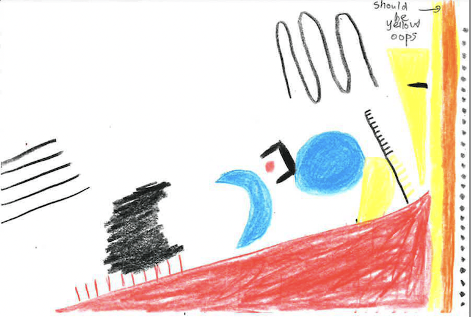

# Wesley Janson 
### CAPP30239-Data Visualization for Policy Analysis 

 (not an artist) 

My name is Wesley Janson (Wes or Wesley is fine), and I am a second-year CAPP student here at UChicago. I am originally from Minnesota, and I did my undergraduate studies at the University of Minnesota. Upon graduating, I spent three years as a Research Analyst at the Federal Reserve Bank of Cleveland. After deciding I did not want to pursue a PhD in Economics, I found CAPP to be the right fit for what I want to do in the future. I am looking to work in the intersection of data science and economic policy, with a focus in computational statistics.