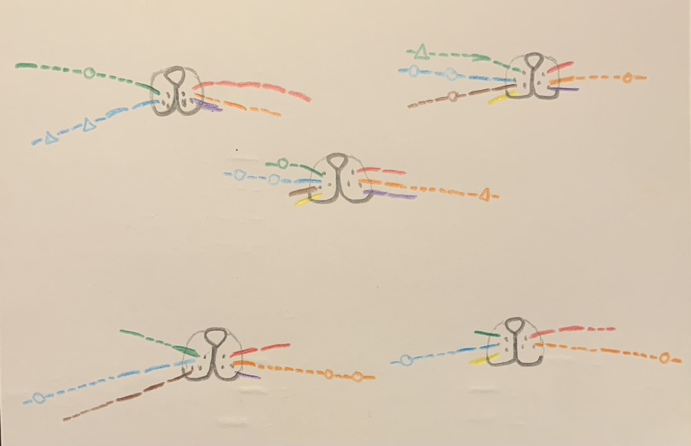
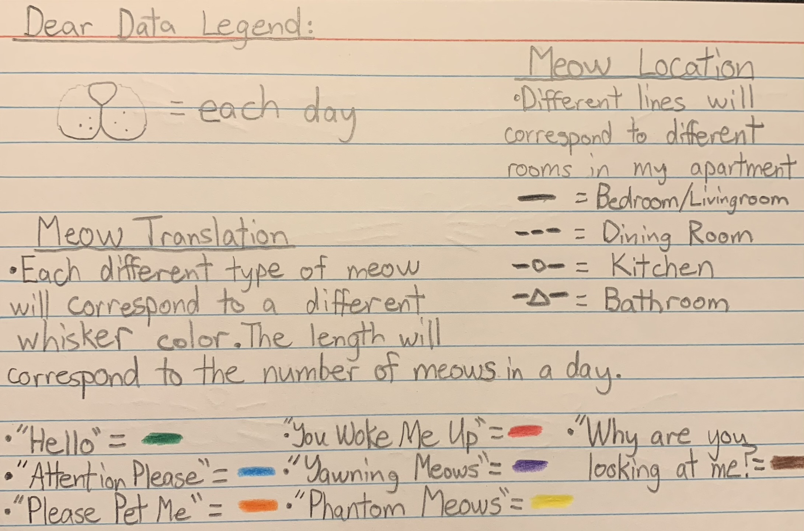

# Week 2

## Dear Data

### How often does Javi meow?

For my Dear Data project, I decided to track how many times each day my cat Javi meows at me. I've always considered him a pretty talkative cat, and it was certainly interesting to quantify it! I feel like I know him pretty well, so I have also taken the liberty to categorize the type of meow he had (I guess a nice display of how subjective data can be) and the room in my apartment in which the meow occurred. 

